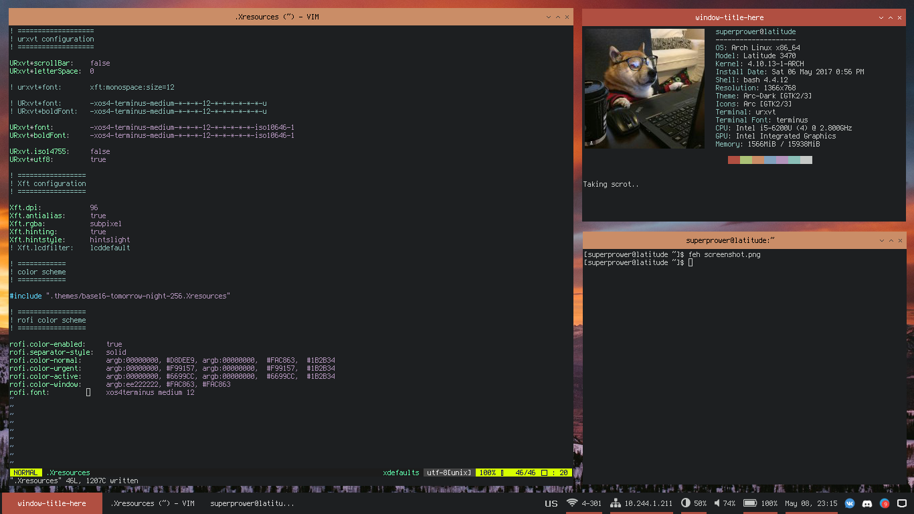
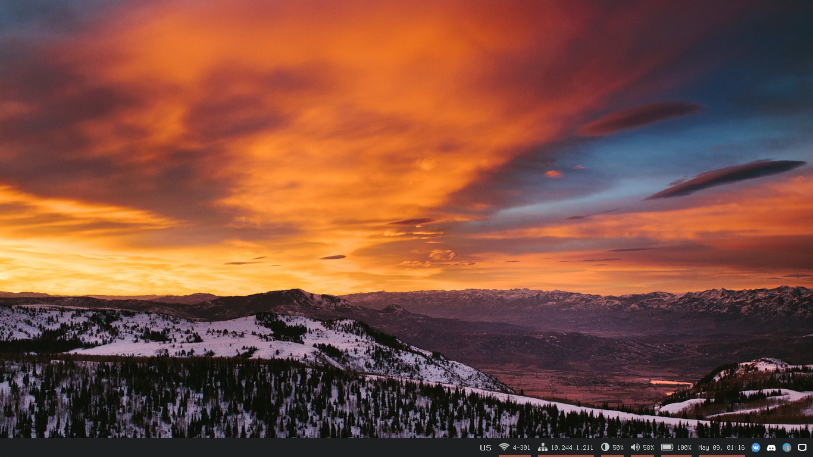

This is my dotfiles.
I mostly borrowed thing from other places and made them like I like.

WM: OpenBox, with slightly adjusted Leaves theme (taken from [/u/Eti_f's](https://github.com/eti0/dots/tree/master/.themes/leaves/openbox-3), big thanks to him!)
Wallpaper: Got one from wonderful [collection of /u/JulianLT](http://imgur.com/gallery/jrGCk) 
Terminal/Panels font: Terminus
Panels: Tint2 + Polybar.
Terminal Colors: base16 Tomorrow Night.
Vim Colors: base16 Tomorrow Night, slightly adjusted to get rid of awful Visual Selection colors.

I really got tired of cold colors of Arc-Dark back in Xubuntu, so I decided to went with something warm and colorful. This is what I came up with.

About PolyBar theme:
It uses underlines to indicate things you will be interested. So, if there is a Wi-Fi or LAN connection, it will highlight those. It will highlight battery if it is discharging or finished charging, and sound if there is any.
PolyBar is wonderful, only shame is that it doesn't have taskbar.
